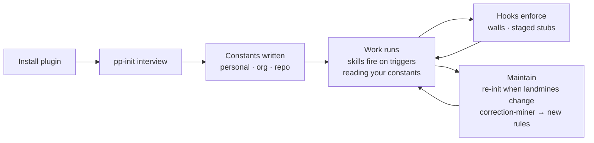

# process-pack

**A portable way of working for agent orchestration.** It turns the discipline that makes a good multi-agent run good - tight delegate briefs, one owner per file, real definitions of done, hard stops at billing and permission walls - into skills, hooks, and a live board that any capable model can pick up and run.

The skills are written to be generic. Every fact that's specific to *you* - your git identities, your model tiers, your repo's landmines, your team's escalation rules - lives in separate constants files that you generate in about ten minutes. One source of process, swappable specifics.

> **Status:** v1.1, pilot-passed. Ran a real production ticket end-to-end (recon → build → three review rounds → merge) with one process correction. All 18 golden fixtures replay clean. Safe to install and use.

---

## The idea in 30 seconds

```
┌─────────────────────────────┐     ┌──────────────────────────────┐
│  SKILLS  (this repo)        │     │  CONSTANTS  (yours)          │
│  generic, zero proper nouns │  +  │  your identities, walls,     │
│  the behavior everyone runs │     │  tiers, repo landmines       │
└─────────────────────────────┘     └──────────────────────────────┘
              │                                    │
              └──────────────┬─────────────────────┘
                             ▼
              Your agent runs the process
              with your specifics filled in
```

A skill says *"file work through the tracker in your constants."* Your constants say *"tickets = Linear, workspace `acme`."* The skill never names Linear, so it travels to the next person unchanged; your constants never leave your machine. That split is the whole design. It's why the pack is portable across people, repos, and models instead of hard-wired to one setup.

---

## Quick start

**1. Add the marketplace and install the plugin** (in Claude Code):

```
/plugin marketplace add designnotdrum/process-pack
/plugin install process-pack@process-pack
```

Installs cleanly into more than one config directory if you run separate personal and work setups - one source, two worlds.

**2. Generate your constants** - run the onboarding interview:

```
Use the pp-init skill to set up my constants.
```

`pp-init` mines what it can from the repo you point it at (git identities, remotes, tracker references, CI check names, lint config) and brings those as prefilled answers to confirm, rather than asking you cold. It writes:

| File | Scope | Lives | Committed? |
|---|---|---|---|
| `personal.yaml` | you | `~/.config/process-pack/` | never |
| `org.yaml` | your org | `~/.config/process-pack/` | never |
| `.process/repo.yaml` | one repo | inside that repo | yes - it describes the repo |

**3. Work normally.** The skills fire on their own triggers from here - you don't invoke them by hand. Ask your agent to dispatch a delegate and `dispatch-brief` compiles the brief; run two lanes and `lane-planner` builds the ownership table; call something done and `verification-gates` checks the evidence.

That's it. Install, ten-minute interview, go.

---

## Lifecycle



- **Install** once per config directory.
- **Init** once per person for personal/org constants; once per repo for `repo.yaml`, re-run when that repo's landmines drift.
- **Run** is the steady state: skills activate on their triggers, always reading specifics from constants, never hardcoding them.
- **Enforce** happens underneath, in hooks, without the model choosing to.
- **Maintain** closes the loop: a correction that keeps recurring becomes a candidate taste rule instead of a repeated nag.

---

## What's in the box

**12 skills, grouped by when they fire:**

*Plan & dispatch*
- **`lane-planner`** - before more than one delegate runs against a repo: the ownership table (one owner per file, phase gating, merge order) that has to exist before dispatch, not after a collision.
- **`dispatch-brief`** - the delegate-brief compiler. A ten-block contract (isolation, verify-then-act, never-wait list, merge policy, anti-stall clause, mandated report format, out-of-scope). Highest-leverage skill in the pack.
- **`resource-wall-preflight`** - before any command that touches an external runtime, account, or billing surface: which wallet, which org, which identity. Stops at a wall instead of working around it.

*Run & track*
- **`lane-board`** - maintains `board.json` as the single source of truth for lane state, written on every transition. Survives compaction; doubles as a standup artifact.
- **`notification-triage`** - classifies every delegate completion (done-with-evidence / stalled / failed / suspect) before anything gets relayed as done. Catches the delegate that says "waiting for my monitor" and resumes it instead of reporting success.

*Decide & verify*
- **`root-cause-first`** - no fix ships without a stated causal mechanism. A contradicted hypothesis counts as progress, not failure.
- **`escalation-policy`** - names the decision classes that always stop for a human, and how to rent a top-tier model as a consultant at a named decision point rather than as the resident driver.
- **`verification-gates`** - definition of done per work class (CI change, flaky-test fix, design round, removal/migration), plus a standing adversarial pre-merge review rule.
- **`feedback-triage`** - splits every review item into one of four buckets before any work starts, so parked items don't get silently rebuilt.

*Taste & upkeep*
- **`taste-rules`** - reads your standing corrections from constants (merge policy, style rules, reuse-existing-patterns) and carries them into every brief and review.
- **`desk-research`** - grounds a technical or design direction in prior art before you commit: a source index, a synthesis, and candidate directions instead of a pile of links.
- **`pp-init`** - the onboarding interview above, and the correction-miner that turns recurring corrections into candidate rules.

**2 hooks** (enforcement the model can't skip):
- **`wall-guard`** - `PreToolUse` on Bash. Blocks a command that invokes one config's runtime from another's session (personal from work and the reverse), with an allowlist override for genuine cases.
- **`stub-guard`** - `PreToolUse` on `git commit`. Greps the staged diff for the local-only stub markers your repo declares and blocks the commit with the file list.

**Board viewer** (`board-viewer/`) - renders one `board.json` two ways, a Gantt (lanes over time with dependencies) and a Kanban (columns by state). Data is the contract; this is just a renderer. Publishable as a single file for anyone watching from a phone.

---

## Where your specifics live

Skills reference constants by scope, never by value. Resolution order is `.process/repo.yaml` in the current repo, then `~/.config/process-pack/*.yaml`.

- **`constants/examples/`** - synthetic, fully anonymized worked examples of every field. Safe to read, copy, and publish.
- **`constants/schemas/`** - the exact shape of each file; `pp-init` validates your drafts against these before writing.
- **Your real constants** live outside this repo (personal/org under `~/.config/process-pack/`, repo constants inside each working repo) and **never contain secrets** - names and labels only.

---

## Extending the pack

Adding or editing a skill? Read **[`docs/authoring.md`](plugins/process-pack/docs/authoring.md)** first - it's the contract. Two rules matter most:

1. **Zero proper nouns in skill text.** If a sentence stops making sense when you swap in a different person, repo, or org, it belongs in a constants file, not the skill. A proper noun in normative text is a spec violation, not a style nit.
2. **Fixture-driven acceptance.** A skill ships only when a top-tier model, given *only* the skill's text plus a golden fixture, makes the rubric's call. If it doesn't, tighten the skill - never edit the fixture to match.

More docs:
- **[`docs/case-studies.md`](plugins/process-pack/docs/case-studies.md)** - real sessions kept as worked examples (non-normative).
- **[`docs/migration-notes.md`](plugins/process-pack/docs/migration-notes.md)** - what in this pack supersedes which earlier loose skills.
- **[`docs/PILOT-SCORECARD.md`](plugins/process-pack/docs/PILOT-SCORECARD.md)** - the first real run, scored.
- **[`docs/REPLAY-REPORT.md`](plugins/process-pack/docs/REPLAY-REPORT.md)** - all 18 fixtures, replayed.

---

## Requirements

- **Claude Code** (or any harness that loads Claude Code plugins and skills).
- Model-portable by design: the skills assume a capable reasoning model, not a specific one. Built and piloted against a judgment-tier model with lower tiers used for delegated work.
